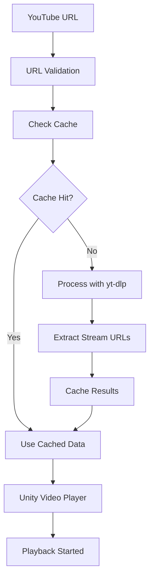
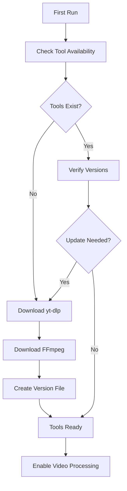

# System Overview

TCS.YoutubePlayer is designed as a modular, extensible system for YouTube video integration in Unity projects. This overview covers the core architecture, key components, and design principles.

## Architecture Principles

### Modular Design
The system is built with clear separation of concerns:
- **Core Logic**: Video processing and playback management
- **Tool Management**: External tool handling (yt-dlp, FFmpeg)
- **UI Layer**: User interface and controls
- **Configuration**: Settings and preferences management

### Async-First Approach
All operations that might block the main thread are implemented using async/await patterns:
- Video URL processing
- Tool downloads
- File operations
- Network requests

### Platform Abstraction
While currently focused on Windows, the architecture supports multi-platform deployment:
- Platform-specific tool paths
- Conditional compilation directives
- Abstracted file system operations

## Core Components

### YoutubePlayer (Main Controller)

The central component that orchestrates all video playback operations:

```csharp
public class YoutubePlayer : MonoBehaviour
{
    // Core functionality
    public async Task PlayVideo(string url);
    public void Pause();
    public void Stop();
    public void SeekTo(float seconds);
    
    // Configuration
    public VideoQuality PreferredQuality { get; set; }
    public bool AllowDownloads { get; set; }
    
    // Events
    public event Action OnVideoStarted;
    public event Action OnVideoEnded;
    public event Action<string> OnError;
}
```

### Tool Management System

Handles automatic downloading and management of external tools:

- **ToolDownloader**: Downloads yt-dlp and FFmpeg
- **VersionManager**: Tracks tool versions and updates
- **PathResolver**: Manages platform-specific paths

```csharp
public class ToolManager
{
    public async Task<bool> EnsureToolsAvailable();
    public string GetToolPath(ToolType tool);
    public async Task<bool> UpdateTool(ToolType tool);
}
```

### URL Processing Pipeline

Converts YouTube URLs into playable video streams:

1. **URL Validation**: Ensures valid YouTube URL format
2. **Metadata Extraction**: Uses yt-dlp to get video information
3. **Stream Selection**: Chooses appropriate quality/format
4. **Caching**: Stores results for faster subsequent access

```csharp
public class UrlProcessor
{
    public async Task<VideoInfo> ProcessUrl(string url);
    public async Task<StreamInfo[]> GetAvailableStreams(string url);
    public VideoInfo GetCachedInfo(string url);
}
```

### Caching System

Intelligent caching reduces redundant network requests:

- **URL Cache**: Stores processed video information
- **Expiration Management**: Handles cache invalidation
- **Storage Optimization**: Manages cache size and cleanup

```csharp
public class CacheManager
{
    public void CacheVideoInfo(string url, VideoInfo info);
    public VideoInfo GetCachedInfo(string url);
    public void ClearExpiredEntries();
    public void ClearAll();
}
```

## Data Flow

### Video Playback Flow



### Tool Management Flow



## Configuration System

### Player Configuration

```csharp
[System.Serializable]
public class YoutubePlayerConfig
{
    [Header("Playback Settings")]
    public VideoQuality preferredQuality = VideoQuality.HD720;
    public bool autoPlay = true;
    public bool loop = false;
    
    [Header("Download Settings")]
    public bool allowDownloads = true;
    public string downloadPath = "StreamingAssets/Downloads";
    
    [Header("Cache Settings")]
    public int maxCacheSize = 100;
    public int cacheExpirationHours = 24;
}
```

### Tool Configuration

```csharp
[System.Serializable]
public class ToolConfig
{
    public string ytDlpVersion = "latest";
    public string ffmpegVersion = "latest";
    public bool autoUpdate = true;
    public string customToolPath = "";
}
```

## Error Handling

### Exception Hierarchy

```csharp
public class YoutubePlayerException : System.Exception { }
public class ToolNotFoundException : YoutubePlayerException { }
public class VideoProcessingException : YoutubePlayerException { }
public class NetworkException : YoutubePlayerException { }
```

### Error Recovery

The system implements several error recovery mechanisms:
- **Retry Logic**: Automatic retries for transient failures
- **Fallback Streams**: Alternative quality options if preferred fails
- **Tool Redownload**: Automatic tool reacquisition if corrupted
- **Cache Invalidation**: Clearing bad cache entries

## Performance Considerations

### Memory Management
- **Texture Streaming**: Efficient video texture handling
- **Cache Limits**: Configurable memory usage bounds
- **Resource Cleanup**: Proper disposal of video resources

### Network Optimization
- **Connection Pooling**: Reuse HTTP connections
- **Compression**: Efficient data transfer
- **Parallel Downloads**: Concurrent tool acquisition

### Threading
- **Main Thread Protection**: UI operations on main thread only
- **Background Processing**: Heavy operations on worker threads
- **Async Coordination**: Proper async/await usage

## Extension Points

### Custom Components

The system supports custom components through interfaces:

```csharp
public interface IVideoProcessor
{
    Task<VideoInfo> ProcessVideo(string url);
}

public interface ICacheProvider
{
    void Store(string key, object value);
    T Retrieve<T>(string key);
}
```

### Event System

Comprehensive event system for integration:

```csharp
public static class YoutubePlayerEvents
{
    public static event Action<VideoInfo> OnVideoLoaded;
    public static event Action<float> OnProgressChanged;
    public static event Action<string> OnQualityChanged;
}
```

## Security Considerations

### Safe URL Processing
- URL validation and sanitization
- Whitelist/blacklist support
- Content filtering options

### Tool Verification
- Checksum verification for downloaded tools
- Secure download channels (HTTPS)
- Version authenticity checks

## Next Steps

- **[Architecture Deep Dive](architecture.md)**: Detailed technical architecture
- **[Youtube Player Component](youtube-player.md)**: Main component documentation
- **[Tool Management](tool-management.md)**: External tool handling
- **[Configuration Guide](../config/player-settings.md)**: Customization options

This overview provides the foundation for understanding how TCS.YoutubePlayer works. Each component is designed to be reliable, performant, and extensible for your specific use cases.